# Blåhaj datapack

**A minecraft datapack that adds the IKEA BLÅHAJ Soft toy shark, whale, giant bread pillow, brown bear and pride sharks as items.**

- You can place the plushies down! Just drop one on a bed or right click with one on an item frame placed on the ground.
- When placed the plushies will face the player. To pick it up, just shift + right click.
- This datapack requires resourcepack on all clients. Datapack is just placed in the servers world folder.

## Content

| Item                | Preview                                                         | Recipe                                                                     |
|---------------------|-----------------------------------------------------------------|----------------------------------------------------------------------------|
| Soft Toy Shark      | 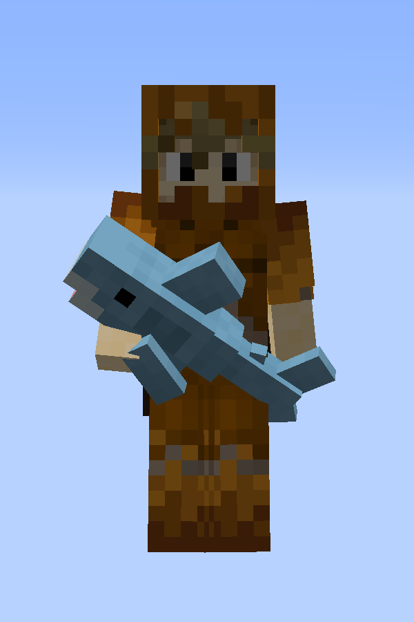 | 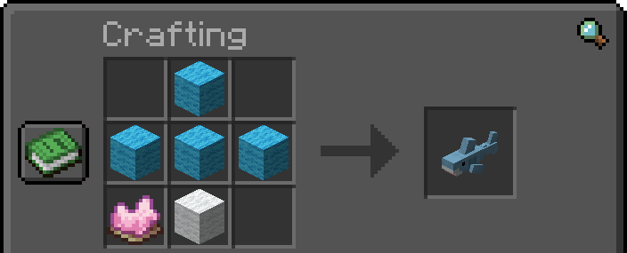      |
| Gray Toy Shark      | 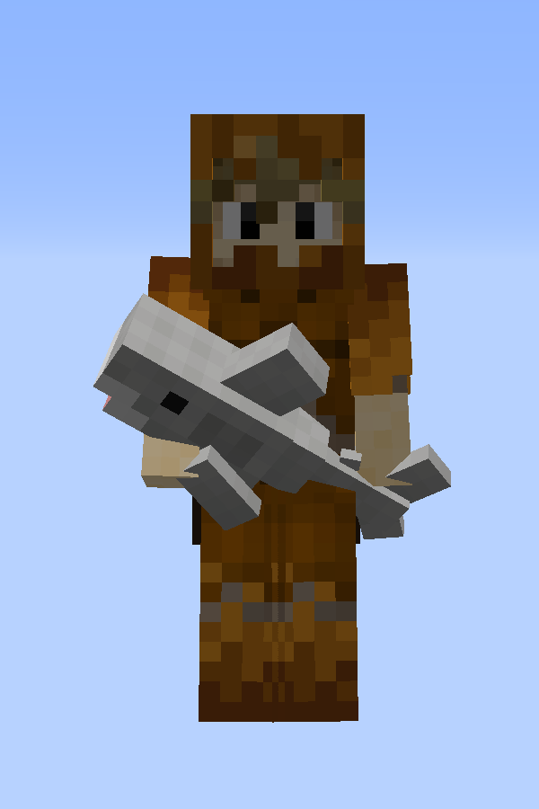 | 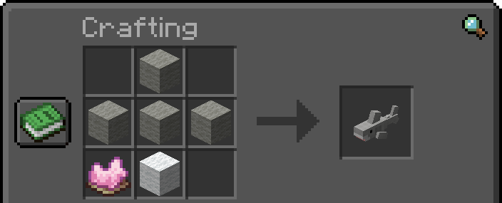 |
| Soft Toy Blue Whale | 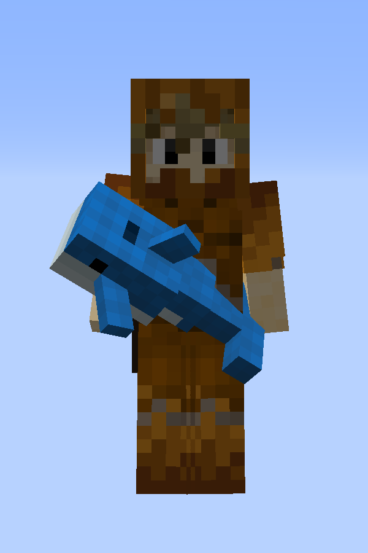 | 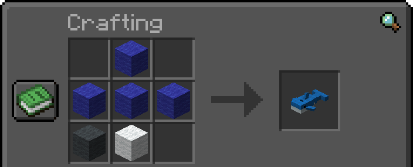   |
| Bread Pillow        | 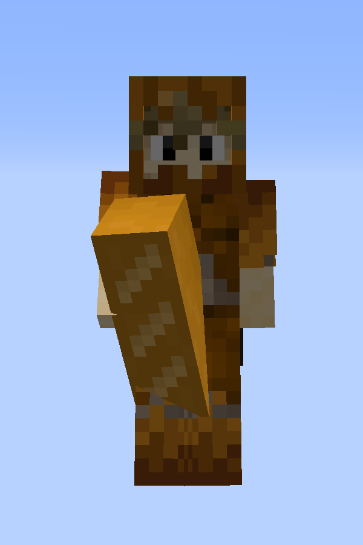 | 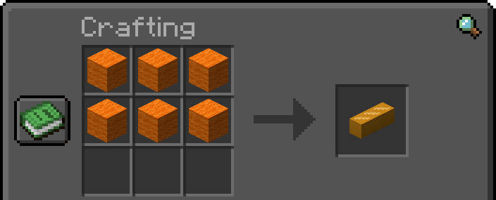     |
| Brown Bear          | 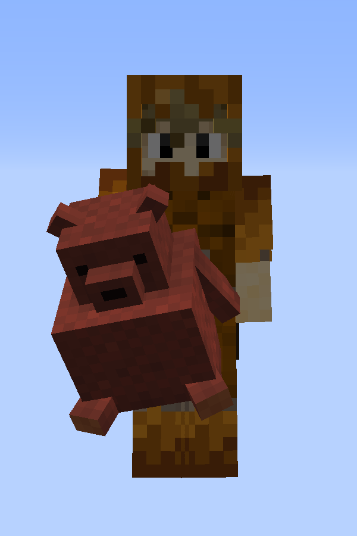 | Gift from Fletchers, Butchers and Leatherworkers when you rescue a village |
| Pride Sharks        | 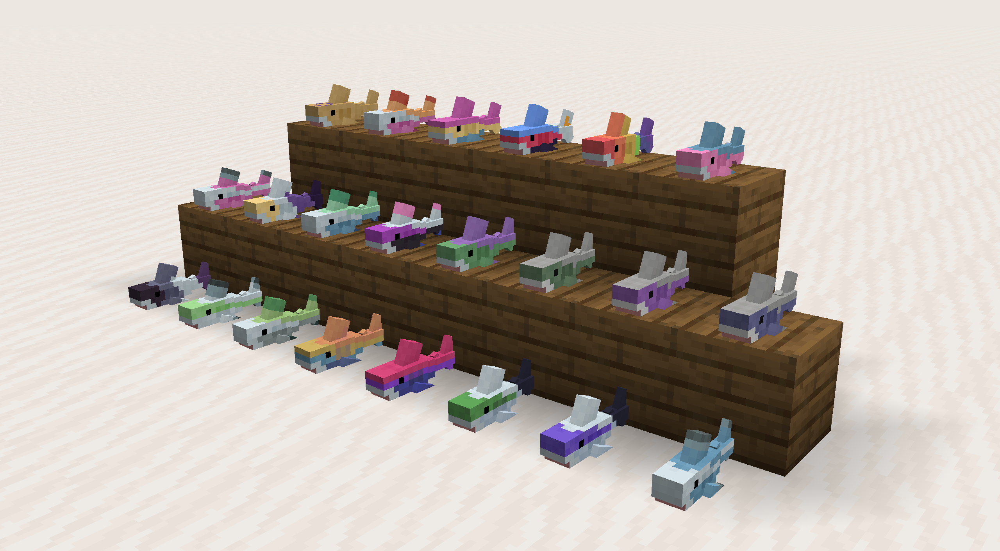 | 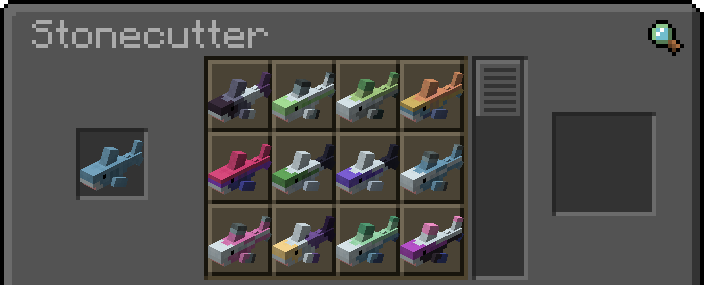     |
| Bed Placement       | 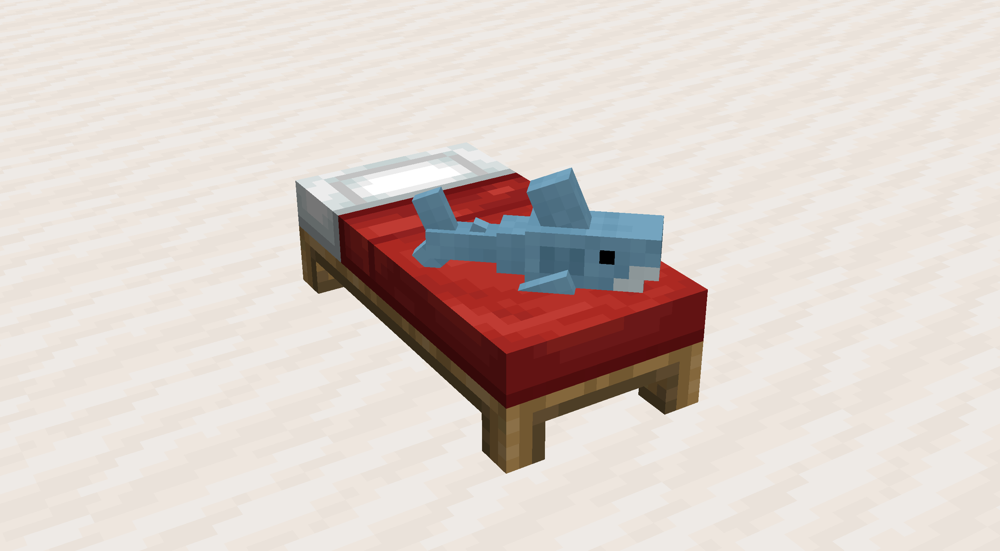 | Place sharks on beds by dropping them on a bed                          |

## Original Fabric Mod

This is a port of the original fabric mod [DaFuqs/Blahaj: BLÅHAJ Soft toy, shark mod, 16px](https://github.com/DaFuqs/Blahaj).

## License

- This datapack - as its original - is licensed under the Unlicense. Feel free to learn from it and incorporate it in your
  own projects.
- The icon of this project is the Blobhaj by Heatherhorns, and is licensed under a Creative Commons Attribution 4.0
  International License.